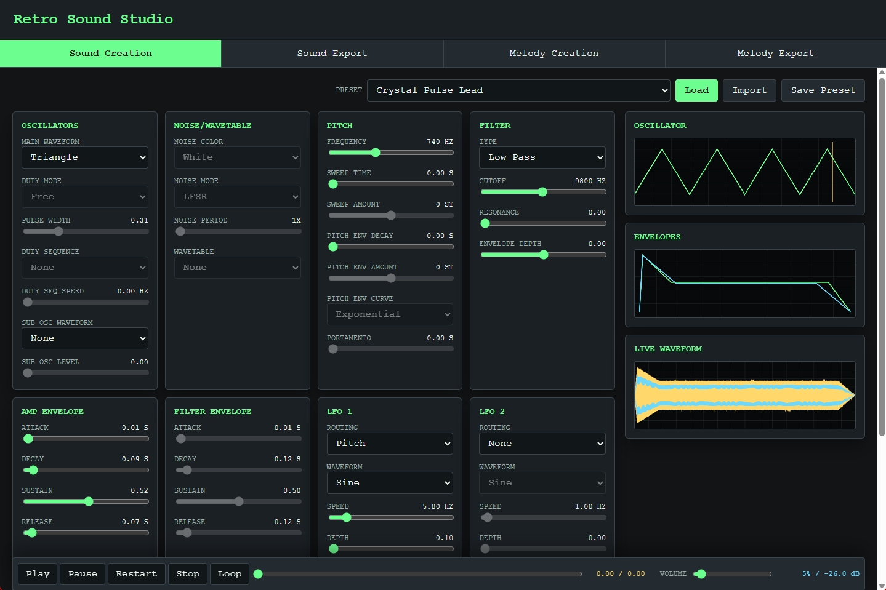

# Retro Sound Studio

Retro Sound Studio is a desktop application for designing retro game audio, from short sound effects to simple layered melodies and export-ready assets.

The app is built with Tauri, a Rust audio/export backend, and a lightweight HTML/CSS/JavaScript interface.

## Features

- Retro synthesizer for game-ready sounds and simple instruments.
- Layered melody editor with piano-roll composition.
- Presets and workflows for reusable audio ideas.
- Visual feedback while shaping sounds.
- Export tools for sounds and melodies.

## How To Use

1. Create or load a sound in **Sound Creation**.
2. Build melodies in **Melody Creation**.
3. Save reusable sounds, melody parts, or complete workflows.
4. Export finished assets from the sound or melody export tabs.

# License

This project is licensed under the MIT License. See the `LICENSE` file for details.
